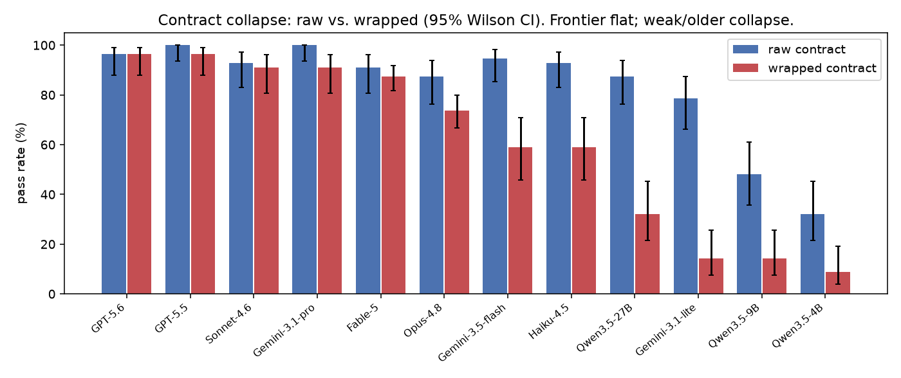
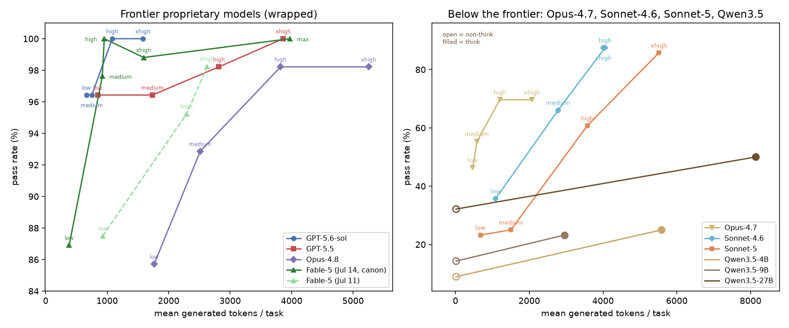
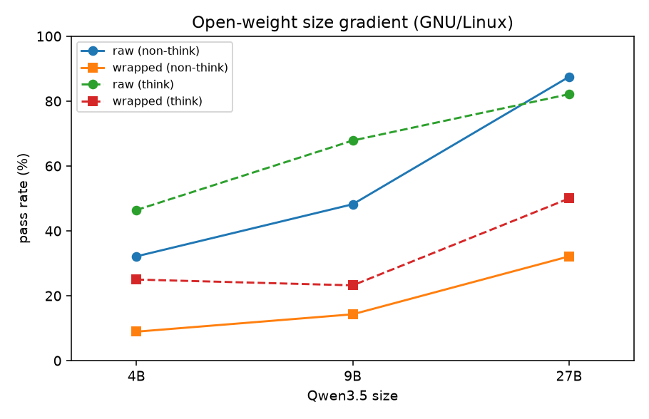
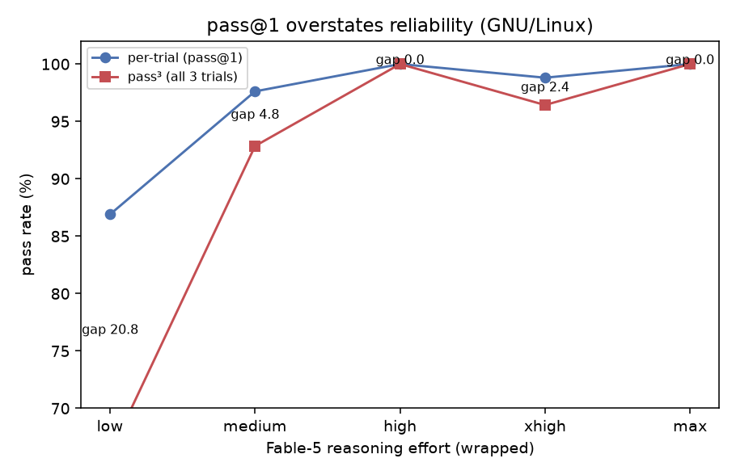

# QuoteBench

A benchmark that isolates **shell quoting/escaping skill** in LLM agents: 14
scenarios × 4 hostility tiers = 56 execution-verified tasks, each solvable by a
single `bash -c` command, evaluated under 3 tool contracts (`raw` / `json` /
`wrapped`) and pass^k reliability trials. Headline metrics: **Quoting Gap**
(benign-control − hostile pass rate; attribution-clean under raw),
**contract drop** (raw − wrapped), and **reliability gap** (per-trial − pass^k).

## Leaderboard

<!-- LEADERBOARD:START -->
| model | raw | wrapped | Δ |
|---|---|---|---|
| GPT-5.5 | 100.0% | **96.4%** | -3.6 |
| GPT-5.6 | 96.4% | **96.4%** | +0.0 |
| Gemini-3.1-pro | 100.0% | **96.4%** | -3.6 |
| Sonnet-4.6 | 92.9% | **91.1%** | -1.8 |
| Fable-5 | 91.1% | **87.5%** | -3.6 |
| Opus-4.8 | 87.5% | **73.8%** | -13.7 |
| Gemini-3.5-flash | 96.4% | **67.9%** | -28.6 |
| Haiku-4.5 | 92.9% | **58.9%** | -33.9 |
| Qwen3.5-27B | 87.5% | **32.1%** | -55.4 |
| Gemini-3.1-flash-lite | 78.6% | **14.3%** | -64.3 |
| Qwen3.5-9B | 48.2% | **14.3%** | -33.9 |
| Qwen3.5-4B | 32.1% | **8.9%** | -23.2 |

*pass@1 on the 56-task core, GNU/Linux reference toolchain; sorted by `wrapped`. Updated 2026-07-15.*

**Legend** — `raw`: the model's reply is executed verbatim (`bash -c <reply>`). `wrapped`: the reply is first pasted into `bash -c "<reply>"` — an extra double-quote layer, exactly what naive agent harnesses do when they transport commands as strings. *Example*: to write `it's done` to a file, `echo "it's done" > out.txt` is correct under `raw`, but under `wrapped` the inner quotes and any `$`/backticks are re-parsed by the outer layer — the model must emit `echo \"it's done\" > out.txt` or the command runs *silently wrong* (exit 0, wrong bytes). **Δ** = wrapped − raw, the *contract drop*. **Why it matters**: raw is how models look in a demo; wrapped is how they are actually driven inside many agent frameworks. A large drop (e.g. Gemini-3.5-flash 96.4→67.9) means a model that aces one-shot shell questions still cannot be trusted to drive a shell through a string-transporting harness.
<!-- LEADERBOARD:END -->

This file is a map; facts live in `docs/`:

- design & metrics → `docs/SPEC.md`
- novelty & prior art → `docs/relatedwork.md`
- dataset card → `docs/paper/datasheet.md`
- license → `LICENSE`
- citation metadata → `CITATION.cff`

The public repository and project site are synchronized from the private release
source by GitHub Actions.

## Results preview

QuoteBench exposes failures that are easy to miss in broad coding benchmarks:

- Some models are strong under direct shell execution but collapse when the same
  command is transported through a wrapped harness. In the frozen-core GNU run,
  Gemini-3.5-flash scores 96.4% under `raw` but 67.9% under `wrapped`.
- Reasoning budget is not a universal fix: saturated models spend more tokens
  without improving accuracy, while mid-capability models can convert effort
  into large gains.
- pass@1 overstates reliability for tail-risk skills. The scorer reports
  pass^k/observed all-pass separately when repeated trials are available.









## Quickstart

```bash
python3 -m quotebench list                 # enumerate 56 frozen-core tasks
python3 -m quotebench show ssh-heredoc/t3-gnarly
python3 -m quotebench validate             # oracle 56/56 + discrimination proof
python3 -m quotebench run --adapter naive --out results/naive.jsonl
OPENAI_BASE_URL=http://localhost:8000/v1 OPENAI_API_KEY=... \
    python3 -m quotebench run --adapter openai --model qwen3.5-9b \
    --contract wrapped --executor docker --out results/qwen.jsonl
python3 -m quotebench run --adapter azure --model YOUR_DEPLOYMENT_NAME \
    --contract wrapped --executor docker --out results/gpt.jsonl
python3 -m quotebench score results/qwen.jsonl
```

No dependencies for the core benchmark (Python 3 stdlib). All benchmark jobs are
`python3 -m quotebench` subcommands (see `quotebench/cli.py`).
For untrusted model output use `--executor docker` (build with `docker build
-t quotebench-runner .`).

## License and citation

QuoteBench is released under the Apache License 2.0. Redistribution must retain
the copyright, license, and NOTICE attribution. If you use QuoteBench in
research, reporting, evaluation, derivative benchmarks, or public comparisons,
please cite the repository metadata in `CITATION.cff`.
